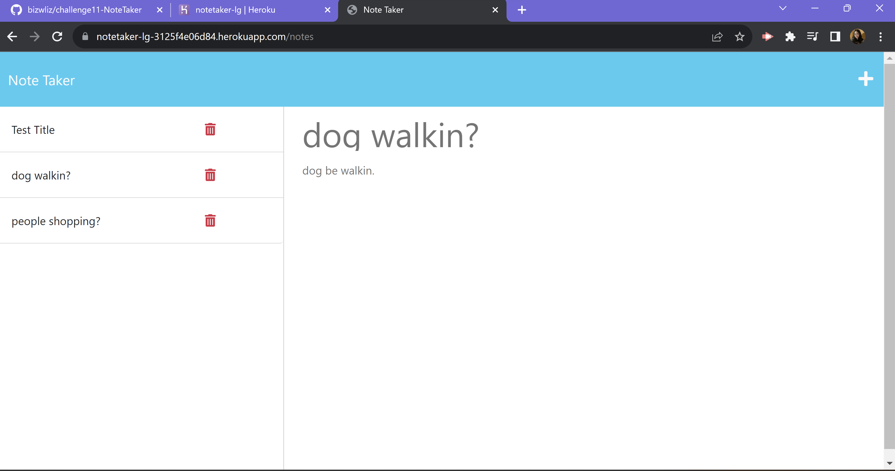

# Challenge 11 Note Taker

## Description
In this challenge i will be demonstarting how to create and route HTML and API to the back end server so that when the client is using the server side, the information (notes) will be stored and saved in the website where it will be readily available for the user to come back to whenever needed. 

## Installation
<ol>
    <li>Create Repository on Github</li>
    <li>Clone Repository to Computer and open in VS Code</li>
    <li>Install Node Modules</li>
    <li>Update Structure</li>
    <li>Create and route html and api/li>
    <li>link to heroku</li>
    <li>Deploy via heroku</li>
    <li>Create README</li>
    <li>Submit Heroku Link & Gitub Repo Link</li>
</ol>

## Usage

Link to github: <a href="https://github.com/bizwliz/challenge10-SVGLogoMaker">Challenge 10 Github</a>

Link to github: <a href="https://notetaker-lg-3125f4e06d84.herokuapp.com/notes">Heroku Live Deployment Link</a>

Website Via Heroku </a>

## License
 

## Tests
Tested using VS Code.